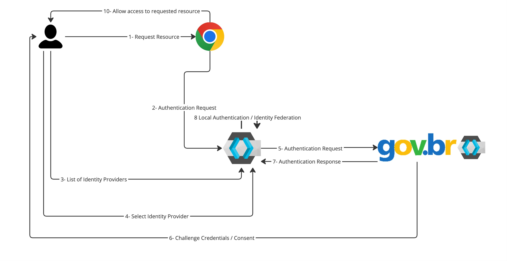
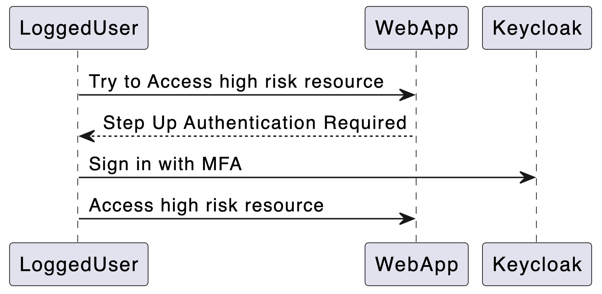
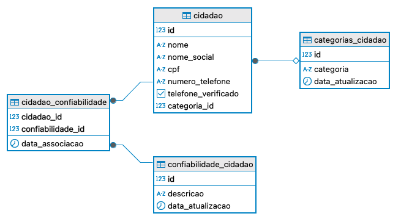

# Implementando uma versão do **gov.br** com Keycloak

Este repositório tem como objetivo demonstrar como implementar uma solução de autenticação similar ao **gov.br** usando o [Keycloak](https://www.keycloak.org/), uma plataforma de gerenciamento de identidade e acesso. A solução mostrará como configurar o Keycloak para criar um provedor de identidade para cidadãos e, ao mesmo tempo, como integrar sua organização utilizando o Keycloak com o **gov.br**.

## Sumário

1. [Objetivo](#objetivo)
2. [Arquitetura](#arquitetura)
3. [Pré-requisitos](#pré-requisitos)
4. [Instalação do Keycloak](#instalação-do-keycloak)
5. [Configuração do Keycloak para um Provedor de Identidade Gov.br](#configuração-do-keycloak-para-um-provedor-de-identidade-govbr)
6. [Integração do Gov.br com Keycloak na sua Organização](#integração-do-govbr-com-keycloak-na-sua-organização)
7. [Benefícios do Uso do Keycloak](#benefícios-do-uso-do-keycloak)
8. [Contribuindo](#contribuindo)
9. [Licença](#licença)

## Objetivo

O objetivo deste repositório é:

- Demonstrar como configurar o **Keycloak** para atuar como um provedor de identidade **gov.br**, similar ao sistema de autenticação do governo brasileiro.
- Mostrar como integrar o **Keycloak** em uma organização para autenticar e gerenciar o acesso dos cidadãos e usuários corporativos de forma segura e escalável.
- Compreender os principais benefícios e as melhores práticas ao adotar o **Keycloak** em uma organização.
- Demonstrar algumas das principais que o **Keycloak** vai permitir implementar na sua organização, como o step up authentication e a autenticação com PassKeys

## Arquitetura

A arquitetura da solução será composta por:

- **Keycloak**: Servindo como provedor de identidade (IdP).
- **Aplicações e Sistemas da Organização**: Serviços que serão integrados ao Keycloak para autenticação federada.
- **Gov.br (Simulado)**: O sistema de autenticação e identidade do governo brasileiro simulado, com foco na autenticação e autorização de cidadãos.

### Fluxo de Autenticação 


### PassKeys

Sim, o **gov.br** pode ficar indisponível, e na verdade foram algumas horas em 2024, e se seu sistema tiver um nível disponibilidade maior, o que podemos fazer? Uma alternativa seria disponibilizar uma forma de login alternativa no Keycloak da organização.

#### Níveis de Disponibilidade

| Disponibilidade | Inatividade Anual            | Inatividade Mensal            | Inatividade Semanal       |
|------------------|-----------------------------|-------------------------------|---------------------------|
| **99,999%**      | 5 minutos e 15 segundos     | 26 segundos                   | 6 segundos                |
| **99,99%**       | 52 minutos e 35 segundos    | 4 minutos e 23 segundos       | 1 minuto                  |
| **99,9%**        | 8 horas, 45 minutos         | 43 minutos e 12 segundos      | 10 minutos                |
| **99%**          | 3 dias, 15 horas e 36 min   | 7 horas e 12 minutos          | 1 hora e 41 minutos       |


Passkeys são uma forma de autenticação sem senha, que utilizam chaves criptográficas para substituir senhas tradicionais. Elas são mais seguras, pois são imunes a ataques de phishing e não podem ser roubadas em vazamentos de dados. Além disso, oferecem conveniência, permitindo login mais rápido e sem a necessidade de lembrar senhas complexas.


### Step Up Authentication

Step Up Authentication é um processo de autenticação adicional que é acionado quando uma transação ou ação de maior risco é identificada, exigindo um nível mais alto de verificação, como biometria ou uma senha temporária, para garantir maior segurança.




## Modelo do banco de dados do gov.br


## Pré-requisitos

Antes de começar, você precisará de:

- **Docker** (para rodar o Keycloak localmente).
- **Java** (para personalizar o Keycloak).
- **Git** (para clonar este repositório).
- **Navegador** (para acessar o Keycloak e a interface de usuário).

## Instalação do Keycloak

1. Clone este repositório:

   ```bash
   git clone https://github.com/viniciusfcf/keycloak-gov.br.git
   cd keycloak-gov.br

## Fontes

## FAQ
[Área do desenvolvedor gov.br](https://www.gov.br/ans/pt-br/centrais-de-conteudo/manuais-do-portal-operadoras/area-do-desenvolvedor)
[Roteiro de Integração do Login Único
](https://acesso.gov.br/roteiro-tecnico/index.html)
[Solicitar Credencial do Login Único](https://acesso.gov.br/roteiro-tecnico/solicitacaocredencialprocesso.html)